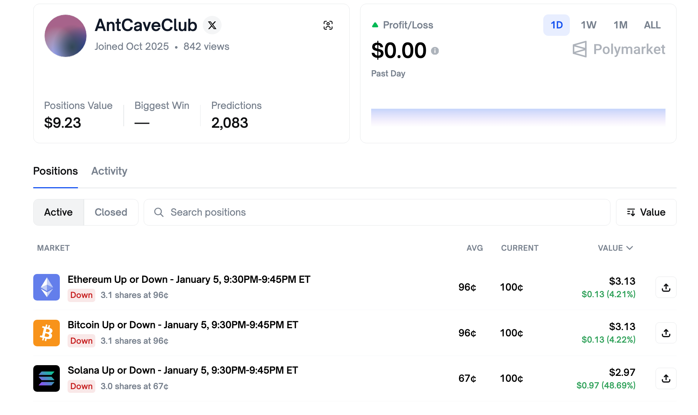
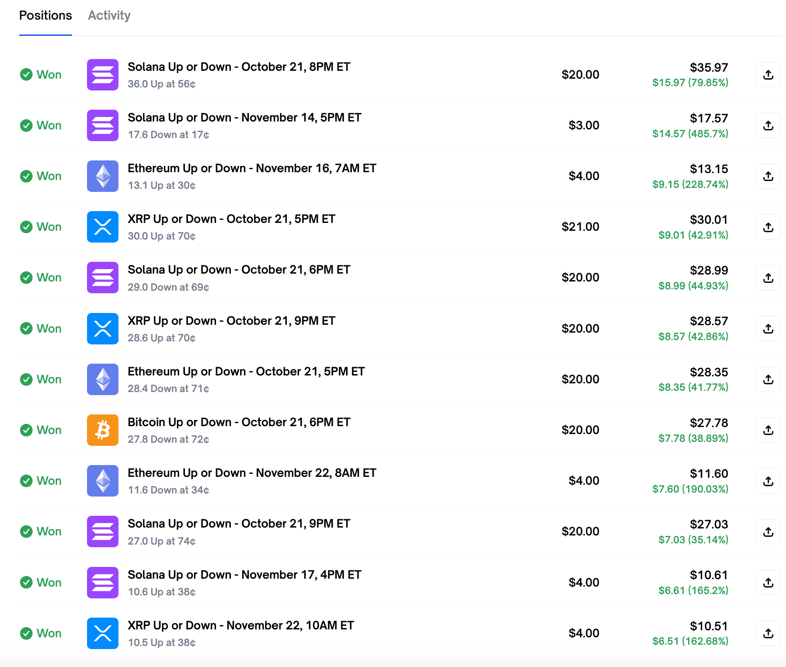
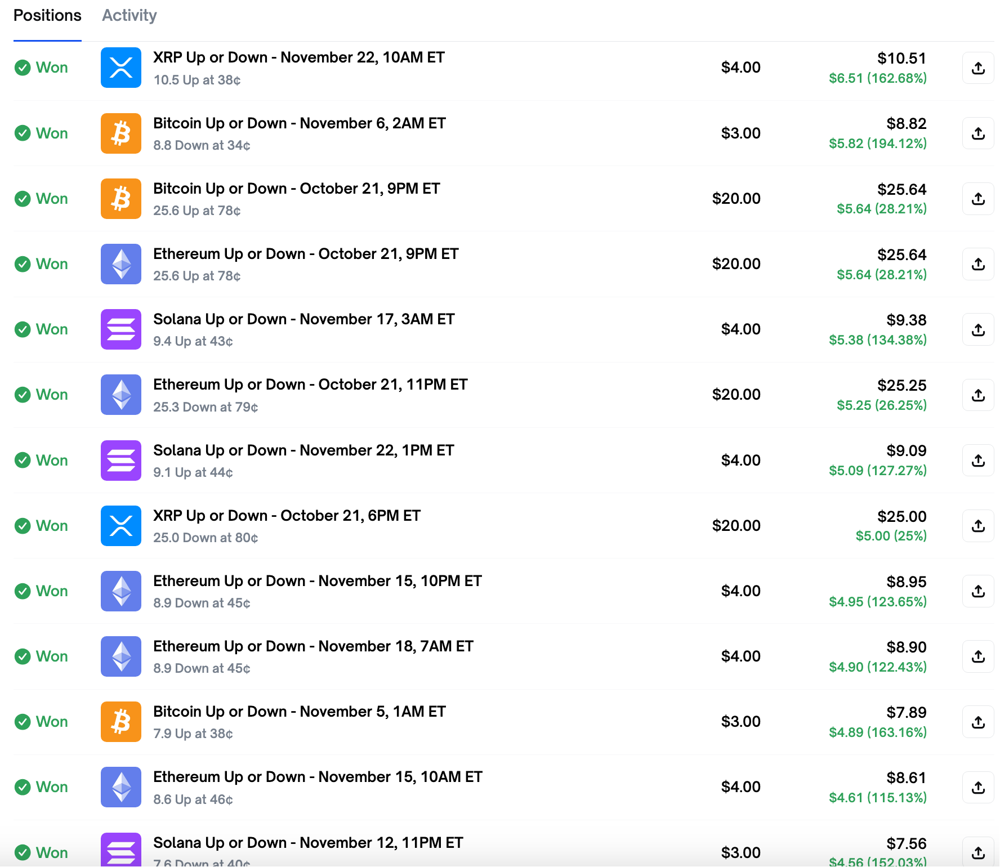
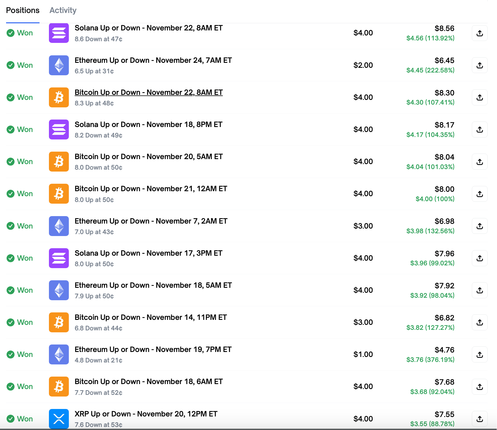
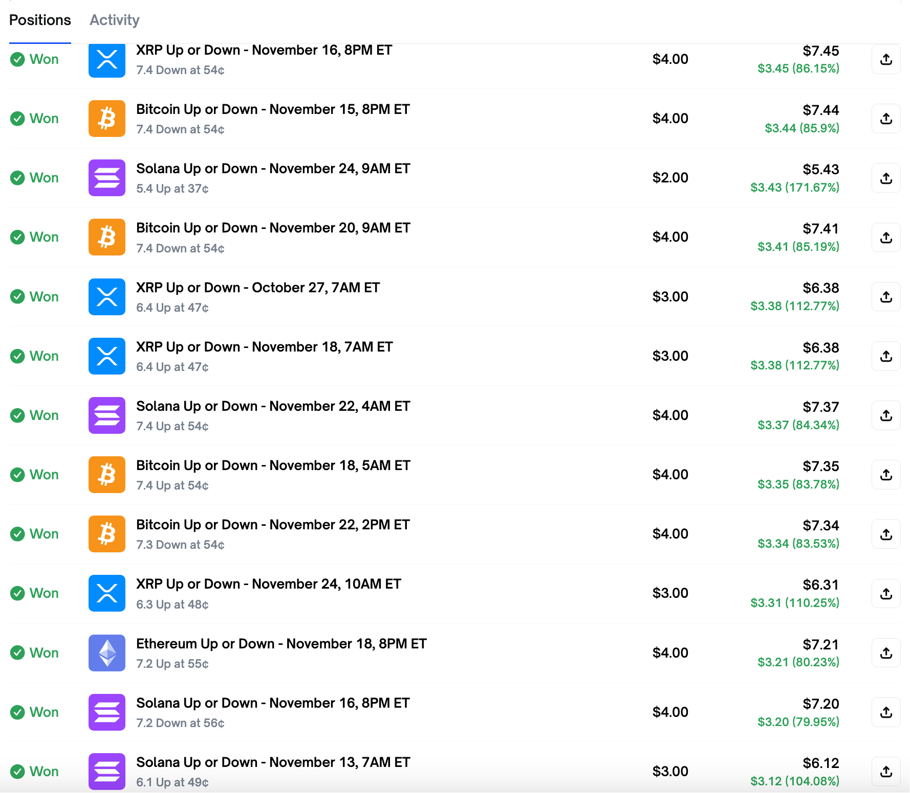
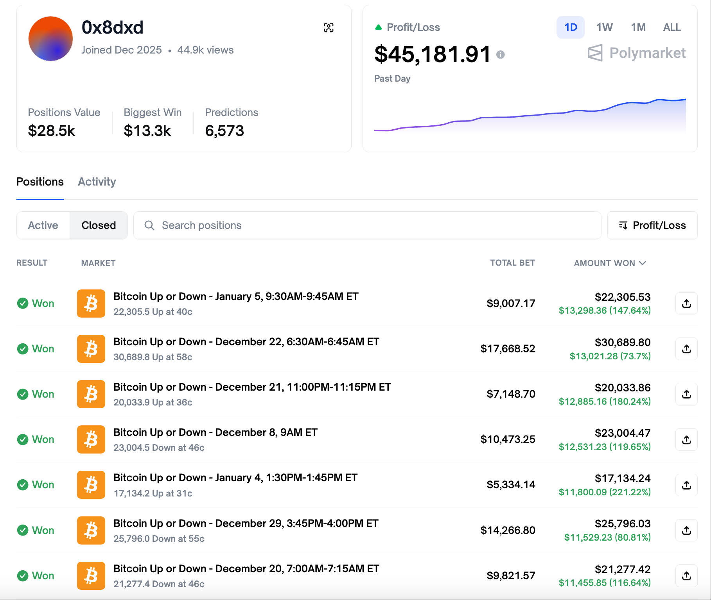
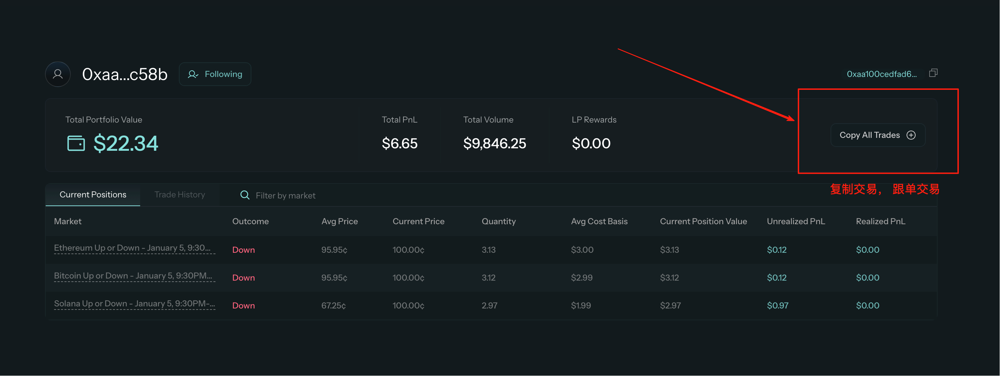

# Polymarket 套利机器人 (15分钟高频交易) — 稳定运行版


一个专为 Polymarket 预测市场设计的自动化交易机器人，主打 ”轻量级、全自动、低延迟”。


# 🤖 Polymarket 极简套利机器人 (SimpleBot)

## 📋 套利功能

本脚本是一个专为 Polymarket 预测市场设计的自动化交易机器人，主打 **"轻量级、全自动、低延迟"**。

*   **🔍 智能市场扫描**：自动筛选 "Crypto" 类别的 15分钟短周期事件，精准捕捉短期波动。
*   **📈 趋势自动跟随**：基于概率阈值（默认 70%）自动判断买入时机，顺势而为。
*   **💰 自动止盈止损**：内置实时 PnL (盈亏) 监控，达到预设比例（默认 ±30%）立即自动清仓锁利/截断亏损。
*   **🔄 自动赎回机制**：每次启动时自动检测链上状态，一键赎回所有已结算的盈利仓位，资金利用率最大化。
*   **🛡️ 流动性保护**：下单前自动检测订单簿 (Order Book) 深度，无对手盘时不盲目下单，避免滑点。
*   **📝 完整交易日志**：使用 SQLite 本地数据库 (`bot_data.db`) 记录每一笔交易详情，方便复盘。

⚠️ Polymarket 在部分地区 API 禁止访问， 目前建议： 日本 🇯🇵 地区 （可用）， 香港、新加坡、美国 （禁止访问）

## ⚙️ 主要配置参数 (可在代码头部修改)

*   `BUY_THRESHOLD`: **70.0** (买入胜率阈值)
*   `TRADE_AMOUNT`: **1** (单笔交易金额 USDC)
*   `ENABLE_PNL_CHECK`: **True** (开启自动止盈止损)
*   `TAKE_PROFIT_PCT`: **30.0** (止盈百分比)
*   `STOP_LOSS_PCT`: **30.0** (止损百分比)
*   `ALLOW_REPEAT_TRADING`: **False** (是否允许重复交易。开启后，若信号持续，每轮都会加仓买入)

## 🛠 安装流程

### 1. 环境准备
确保您的电脑已安装 **Python 3.10+**。

### 2. 安装依赖
在项目根目录下打开终端，运行以下命令安装所需库：

```bash
pip install py-clob-client python-dotenv web3 requests

python3 -m venv venv
source venv/bin/activate  # Linux/Mac


```

### 3. 配置环境
 
代码中对应位置，填入您的 Polygon 链钱包私钥：

```ini
PRIVATE_KEY=0x您的私钥...
RPC_URL=https://polygon-rpc.com
```

### 4. 运行脚本
```bash
python3 simple_bot.py
```

## 🧠 完成策略 (Strategy)

本机器人采用 **高胜率短线趋势策略**：

1.  **🎯 标的筛选**：
    *   只关注 **Crypto (加密货币)** 类别。
    *   只操作 **15分钟** 级别的超短线事件（结果反馈快，资金周转高）。
2.  **📊 信号触发**：
    *   实时监控盘口概率。
    *   当 **Probability (概率) > 70%** (可配置 `BUY_THRESHOLD`) 时，判定为强趋势，执行买入。
3.  **⚡️ 交易执行**：
    *   使用 **FAK (Fill And Kill)** 订单类型：能成交多少成交多少，剩下的自动取消，绝不挂单等待。
    *   **单笔固定金额** (默认 1 USDC)：严格控制单次风险暴露。
4.  **🛑 退出机制**：
    *   **止盈 (Take Profit)**：浮盈 > 30% -> 市价卖出。
    *   **止损 (Stop Loss)**：浮亏 > 30% -> 市价卖出。
    *   **到期赎回**：若持有到期，脚本重启时自动调用合约赎回 USDC。

## ⚙️ 技术特点

*   **🔗 深度链上交互**：
    *   集成 **Web3.py**，直接与 CTF Exchange 合约交互。
    *   智能 **Auto-Approve**：自动检测并完成 USDC 和 CTF 合约授权。
    *   **Gas 优化**：自动计算最优 Gas Price，确保交易快速上链。
*   **⚡️ 极速 API 引擎**：
    *   基于 Polymarket 官方 **CLOB API**，毫秒级下单响应。
    *   HTTP Keep-Alive 长连接，减少网络握手延迟。
*   **🛡️ 健壮性设计**：
    *   **异常熔断**：API 报错、网络超时自动重试或优雅降级。
    *   **兼容性**：自动适配 Web3.py v6/v7 不同版本的签名逻辑。
*   **📦 零依赖部署**：
    *   无需安装 Redis/MySQL，单文件 + SQLite 即可跑通全流程。

## 🚀 实战效果

*   **✅ 稳定运行**：经测试可连续 24小时无人值守运行，自动处理网络波动。
*   **✅ 风险可控**：通过 FAK 订单和流动性预检，有效避免了 "插针" 和 "买入即亏损" 的情况。
*   **✅ 资金闭环**：从 **充值 -> 交易 -> 获利 -> 赎回** 全流程打通，无需手动去网页端操作。

🧪 实验钱包：  0xAa100CedFAD662823c3773346c295146a812C58b   








💰 实战钱包：  https://polymarket.com/@0x8dxd





如需直接复制实验钱包地址，请点击下方链接：

[TradeFox 复制跟单](https://thetradefox.com?ref=BMRNXM)




# 💎 源码地址

*   ** Polymarket 套利机器人 15M 高频交易版 **: [获取源码](https://holly.ink/archives/907)

## 📞 定制联系

‼️ 策略会因为市场变化而失效， 请及时调整参数。

如果您需要定制更高级的策略（如套利、做市、多账号矩阵），或有任何技术疑问，欢迎联系：

*   **开发者**: AntCaveClub
*   **Telegram**: [@madaodev](https://t.me/madaodev)
*   **X**: [@MaxGuruAI](https://x.com/MaxGuruAI)

---
*💡 投资有风险，量化需谨慎。祝您交易愉快！*
